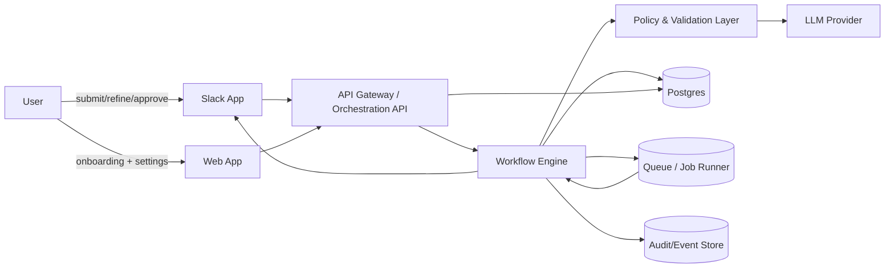
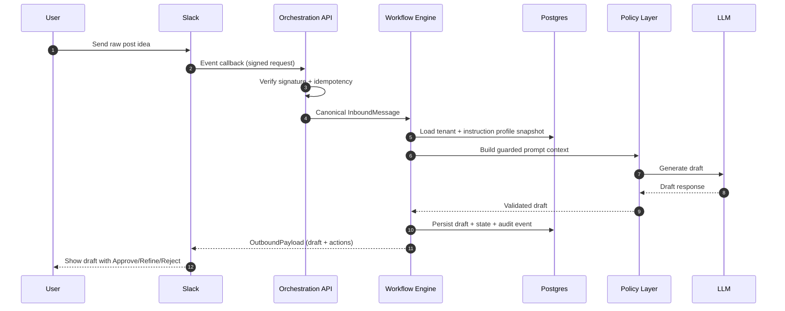
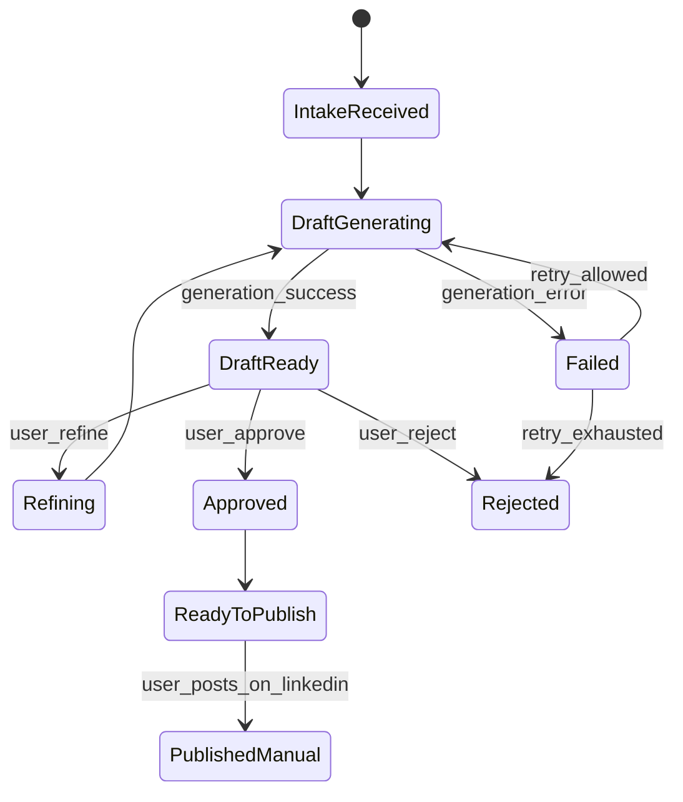
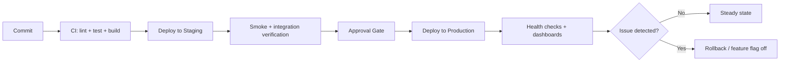

# LinkedIn Agent Architecture

Last updated: 2026-05-03  
Scope: MVP architecture (Slack first, DB-backed instruction profiles, cloud-hosted stack)

---

## 1) Architecture goals

- Keep one deterministic agent workflow across channels.
- Ship fast with Slack-only connector for MVP.
- Keep compliance strong with human approval before publish.
- Store user instruction profiles in database (no external document dependency for now).
- Preserve a clean adapter boundary for future WhatsApp/Discord connectors.

---

## 2) High-level system architecture



### Core components

- **Web App**: onboarding, Slack connect, instruction profile CRUD, policy settings, history.
- **Slack Adapter**: verifies Slack requests and maps interaction payloads to canonical events.
- **Orchestration API**: auth, tenant routing, idempotency, request normalization.
- **Workflow Engine**: state machine for intake -> draft -> refine -> approve/reject -> ready-to-publish.
- **Policy Layer**: style checks, banned phrases, claim guardrails.
- **Instruction Profile Service**: loads versioned profile snapshots from DB.
- **Audit/Event Store**: immutable record for compliance and debugging.

---

## 3) Waterfall delivery flow (MVP planning/execution)

```mermaid
flowchart TD
  R[Requirements\n(PRD + constraints)] --> D[Design\n(architecture + state machine)]
  D --> I[Implementation\n(Slack adapter + API + workflow + DB schema)]
  I --> T[Testing\n(unit + integration + e2e + failure paths)]
  T --> DE[Deployment\n(staging -> production)]
  DE --> O[Operations\n(observability + incident playbooks)]
```

> Notes:
> - This project can still execute iteratively, but this waterfall view shows phase ownership and handoff order.
> - Phase gates should use pilot metrics from `PRD.md` section 9.

---

## 4) Runtime request flow (user -> draft)



---

## 5) State machine flow



### Guardrails

- `Approved` requires policy checks pass.
- Publish remains manual in MVP (outside automation boundary).
- Every transition writes an audit event.

---

## 6) Data flow (including failure paths)

```text
INPUT (Slack/Web)
  -> Signature/Auth Validation
  -> Tenant + Conversation Resolution
  -> Instruction Profile Snapshot Load (DB)
  -> Prompt Assembly + Policy Pre-Checks
  -> LLM Draft Generation
  -> Policy Post-Checks
  -> Persist Draft + State + Audit
  -> Return Actions to Slack

Failure branches:
- Invalid signature -> 401 + security log (no workflow transition)
- Duplicate event -> idempotent skip + info log
- Missing instruction profile -> fallback to default profile version
- LLM timeout -> retry once, then Failed state + user-visible message
- Policy fail -> block Approve, return actionable reason in Slack
```

---

## 7) Deployment flow



### Rollback strategy

- Disable new workflow features by feature flag.
- Keep Slack ingress alive, but route new requests to safe fallback message when severe incidents happen.
- Rollback app image + run DB-safe backward-compatible migrations only.

---

## 8) Storage design (MVP)

```text
Core tables:
- tenants
- users
- connectors (slack metadata/tokens)
- conversations
- instruction_profiles
- instruction_profile_versions
- drafts
- workflow_states
- audit_events
```

### Instruction profile model (DB)

- One active instruction profile per user (or per tenant-policy override).
- Versioned rows in `instruction_profile_versions`.
- Draft stores `instruction_profile_version_id` for traceability.

---

## 9) Future connector expansion architecture

```text
Current:
  SlackAdapter -> CanonicalEvent -> WorkflowEngine

Future:
  SlackAdapter   \
  DiscordAdapter  -> CanonicalEvent -> WorkflowEngine
  WhatsAppAdapter/
```

Connector rule: adapters only translate transport and interaction semantics.  
They must not contain business workflow logic.

---

## 10) Non-functional architecture requirements

- **Security**: signed webhooks, encrypted tokens, strict tenant scoping.
- **Reliability**: idempotent event handling, retries with bounded backoff, dead-letter queue for failed jobs.
- **Observability**: correlation id (`conversation_id`) across API, jobs, LLM calls, and audit events.
- **Performance**: cache instruction profile snapshots; keep prompt size bounded.

---

## 11) Possible tech stack (MVP)

This stack is intentionally pragmatic: fast to ship, easy to operate, and aligned with Slack-first workflow + future adapter expansion.

- **Frontend (web app)**: Next.js (TypeScript), Tailwind CSS, shadcn/ui
- **API / orchestration**: NestJS (TypeScript), Zod for schema validation, OpenAPI for contracts
- **Workflow engine**: Temporal (preferred) or BullMQ-based deterministic state machine
- **Slack integration**: Slack Bolt SDK + signed request verification middleware
- **LLM layer**: provider-agnostic client (OpenAI/Anthropic adapter pattern) with prompt/version registry
- **Database**: PostgreSQL (Supabase or managed Postgres), Prisma ORM
- **Queue / jobs**: Redis + BullMQ (if Temporal is not used for all async work)
- **Cache**: Redis for instruction snapshot/cache and idempotency keys
- **Storage / secrets**: cloud KMS + secret manager, object storage for optional artifacts
- **Auth**: Clerk/Auth.js or Supabase Auth (web), Slack OAuth for connector authorization
- **Infra / hosting**: Vercel (web) + Fly.io/Render/AWS ECS (API/worker), Terraform for infra-as-code
- **Observability**: OpenTelemetry + Sentry + structured logs (Datadog/Loki) + uptime checks
- **CI/CD**: GitHub Actions (lint/test/build/deploy), staged rollouts with feature flags
- **Testing**: Vitest/Jest (unit), Playwright (e2e), contract tests for adapter payload schemas

### Minimal default choice (if deciding quickly)

- Next.js + TypeScript
- NestJS + TypeScript
- PostgreSQL + Prisma
- Redis + BullMQ
- Slack Bolt
- OpenAI/Anthropic adapter
- Sentry + OpenTelemetry
- GitHub Actions + Vercel + Fly.io

---

## 12) Open architecture decisions

1. Tenant model: workspace-first B2B vs user-first prosumer.
2. Profile ownership: user-level profile only vs user + org policy layering.
3. Retention policy: audit event retention window by region/compliance.
4. Async topology: single queue vs separated queues (generation, delivery, audit).

