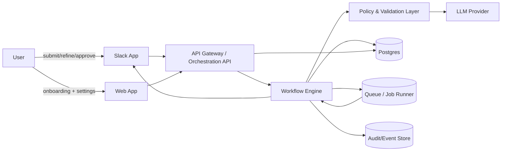
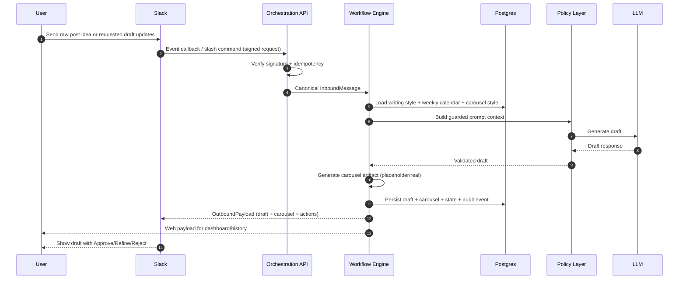
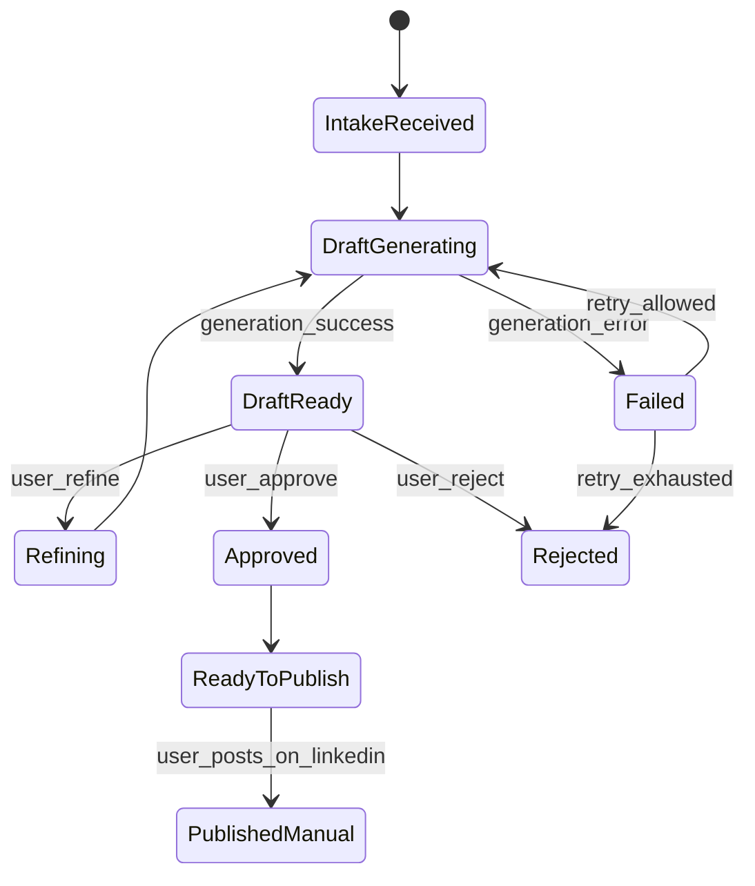
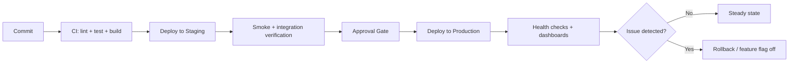

# LinkedIn Agent Architecture

Last updated: 2026-05-10  
Scope: MVP architecture (Slack first, DB-backed instruction profiles, cloud-hosted stack)

---

## 1) Architecture goals

- Keep one deterministic agent workflow across channels.
- Ship fast with Slack-only connector for MVP.
- Prioritize landing page plus post-generation workflow before deeper platform phases.
- Keep compliance strong with human approval before publish.
- Store user instruction profiles in database (no external document dependency for now).
- Preserve a clean adapter boundary for future WhatsApp/Discord connectors.

---

## 2) High-level system architecture




### Core components

- **Web App**: onboarding, Slack connect, instruction profile CRUD, policy settings, history.
- **Slack Adapter**: verifies Slack requests and maps interaction payloads to canonical events.
- **Orchestration API**: auth (Slack-signed ingress vs Clerk-verified web requests), tenant routing, idempotency, request normalization.
- **Workflow Engine**: state machine for intake -> draft -> refine -> approve/reject -> ready-to-publish.
- **Scheduler**: per-user cron-triggered workflow starts.
- **Policy Layer**: style checks, banned phrases, claim guardrails.
- **Instruction Profile Service**: loads versioned profile snapshots from DB.
- **Carousel Renderer**: generates a carousel artifact from per-user carousel design language.
- **Audit/Event Store**: immutable record for compliance and debugging.

### Authentication (web): Clerk

The web app and browser-originated API calls use **[Clerk](https://clerk.com)** for identity and sessions. Slack connector traffic continues to use Slack signing secrets and Slack OAuth; that is separate from Clerk.

| Concern | Approach |
| -------- | -------- |
| **Next.js app** | `@clerk/nextjs` — `ClerkProvider`, sign-in/up UI, and middleware protecting routes such as onboarding, settings, and activity/history. |
| **Orchestration API (web)** | Validate **Clerk session JWTs** on `/v1/me/*` (and similar user-scoped routes): verify signature against Clerk JWKS, enforce issuer/audience, short lifetime. Accept `Authorization: Bearer <token>` from the web client or use Clerk’s recommended server-side session verification pattern for your deployment shape (e.g. Next.js calling API routes or Express with shared verification helper). |
| **Identity mapping** | Map Clerk `sub` (user id) to an internal `User` row — persist `clerkUserId` (or equivalent) on `users` for stable joins with tenants and instruction profiles. |
| **Directory sync** | Prefer **Clerk webhooks** (`user.created`, `user.updated`, `user.deleted`) to upsert internal users and handle email/metadata changes; alternatively lazy-create internal `User` on first successful JWT-verified request if webhook infra is deferred. |
| **Connector OAuth** | **Slack OAuth** remains the path for installing the Slack app and storing workspace tokens in `connectors`; Clerk does not replace Slack’s OAuth for the bot/workspace link. |

Security notes: never trust client-only claims without JWT verification; keep Clerk **publishable** key in the web app and **secret** keys / webhook signing secrets only on the server; rotate keys via Clerk dashboard if compromised.

---

## 3) Waterfall delivery flow (MVP planning/execution)

```mermaid
flowchart TD
  R[Requirements\n(PRD + constraints)] --> D[Design\n(architecture + state machine)]
  D --> I[Implementation\n(Slack adapter + API + workflow + DB schema)]
  I --> T[Testing\n(unit + integration + e2e + failure paths)]
  T --> DE[Deployment\n(staging -> production)]
  DE --> O[Operations\n(observability + incident playbooks)]
```


> Notes:
>
> - This project can still execute iteratively, but this waterfall view shows phase ownership and handoff order.
> - Phase gates should use pilot metrics from `PRD.md` section 9.

---

## 4) Runtime request flow (user -> draft + carousel)




---

## 5) State machine flow




### Guardrails

- `Approved` requires policy checks pass.
- Publish remains manual in MVP (outside automation boundary).
- Every transition writes an audit event.

---

## 6) Data flow (including failure paths)

```text
INPUT (Slack signed requests / Web + Clerk JWT)
  -> Signature or JWT Validation (Slack vs Clerk)
  -> Tenant + Conversation Resolution
  -> Instruction Profile Snapshot Load (DB)
  -> Prompt Assembly + Policy Pre-Checks
  -> LLM Draft Generation
  -> Policy Post-Checks
  -> Persist Draft + State + Audit
  -> Return Actions to Slack

Failure branches:
- Invalid Slack signature or invalid/expired Clerk JWT -> 401 + security log (no workflow transition)
- Duplicate event -> idempotent skip + info log
- Missing instruction profile -> fallback to default profile version
- LLM timeout -> retry once, then Failed state + user-visible message
- Policy fail -> block Approve, return actionable reason in Slack
```

---

## 7) Deployment flow




### Rollback strategy

- Disable new workflow features by feature flag.
- Keep Slack ingress alive, but route new requests to safe fallback message when severe incidents happen.
- Rollback app image + run DB-safe backward-compatible migrations only.

---

## 8) Storage design (MVP)

```text
Core tables:
- tenants
- users (map to Clerk via stored Clerk user id on the user record)
- connectors (slack metadata/tokens)
- conversations
- instruction_profiles
- instruction_profile_versions
- workflow_preferences (per-user writing style, weekly calendar, carousel design language)
- schedule_configs (per-user cron expression + enabled flag + source)
- drafts
- workflow_states
- audit_events
```

### Instruction profile model (DB)

- One active instruction profile per user (or per tenant-policy override).
- Versioned rows in `instruction_profile_versions`.
- Draft stores `instruction_profile_version_id` for traceability.

### Workflow preference and schedule model

- `workflow_preferences` stores user-configurable:
  - `writingStyle`
  - `weeklyCalendar`
  - `carouselDesignLanguage`
- `schedule_configs` stores:
  - `cronExpression` (Unix cron)
  - `enabled`
  - `updatedVia` (`web` or `slack_command`)
- Slack command `/set-repeat` updates `schedule_configs` through the same API contract as the web settings page.

---

## 9) Trigger and delivery paths (priority slice)

```text
Manual trigger path:
Web form or Slack message -> API draft generation endpoint
  -> Load per-user preferences
  -> LLM draft
  -> Carousel generation step
  -> Return/persist for Slack + Web targets

Scheduled trigger path:
Cron scheduler tick
  -> Resolve users with enabled schedule_configs
  -> Trigger same draft generation pipeline
  -> Deliver to Slack + Web

Slack scheduling command path:
/set-repeat <cron expression>
  -> Slack command endpoint
  -> Validate expression + upsert schedule_configs
  -> Acknowledge updated cadence
```

---

## 10) Future connector expansion architecture

```text
Current:
  SlackAdapter -> CanonicalEvent -> WorkflowEngine

Future:
  SlackAdapter   \
  DiscordAdapter  -> CanonicalEvent -> WorkflowEngine
  WhatsAppAdapter/
```

Connector rule: adapters only translate transport and interaction semantics.  
They must not contain business workflow logic.

---

## 11) Non-functional architecture requirements

- **Security**: signed Slack webhooks, **Clerk JWT validation** for web-originated API calls, encrypted tokens (Slack, DB), strict tenant scoping.
- **Reliability**: idempotent event handling, retries with bounded backoff, dead-letter queue for failed jobs.
- **Observability**: correlation id (`conversation_id`) across API, jobs, LLM calls, and audit events.
- **Performance**: cache instruction profile snapshots; keep prompt size bounded.

---

## 12) Possible tech stack (MVP)

This stack is intentionally pragmatic: fast to ship, easy to operate, and aligned with Slack-first workflow + future adapter expansion.

- **Frontend (web app)**: Next.js (TypeScript), Tailwind CSS, shadcn/ui
- **API / orchestration**: Express JS (TypeScript), Zod for schema validation, OpenAPI for contracts
- **Workflow engine**: Temporal (preferred) or BullMQ-based deterministic state machine
- **Slack integration**: Slack Bolt SDK + signed request verification middleware
- **LLM layer**: provider-agnostic client (OpenAI/Anthropic adapter pattern) with prompt/version registry
- **Database**: PostgreSQL (Supabase or managed Postgres), Prisma ORM
- **Queue / jobs**: Redis + BullMQ (if Temporal is not used for all async work)
- **Cache**: Redis for instruction snapshot/cache and idempotency keys
- **Storage / secrets**: cloud KMS + secret manager, object storage for optional artifacts
- **Auth**: **Clerk** for web sign-in/sessions and JWT verification on user-scoped API routes; **Slack OAuth** only for Slack workspace/bot connector installation (tokens in `connectors`)
- **Infra / hosting**: Vercel (web) + Fly.io/Render/AWS ECS (API/worker), Terraform for infra-as-code
- **Observability**: OpenTelemetry + Sentry + structured logs (Datadog/Loki) + uptime checks
- **CI/CD**: GitHub Actions (lint/test/build/deploy), staged rollouts with feature flags
- **Testing**: Vitest/Jest (unit), Playwright (e2e), contract tests for adapter payload schemas

### Minimal default choice (if deciding quickly)

- Next.js + TypeScript
- Clerk (`@clerk/nextjs` + API JWT verification)
- Express js + TypeScript
- PostgreSQL + Prisma
- Redis + BullMQ
- Slack Bolt
- OpenAI/Anthropic adapter
- Sentry + OpenTelemetry
- GitHub Actions + Vercel + Fly.io

---

## 13) Open architecture decisions

1. Tenant model: workspace-first B2B vs user-first prosumer.
2. Profile ownership: user-level profile only vs user + org policy layering.
3. Retention policy: audit event retention window by region/compliance.
4. Async topology: single queue vs separated queues (generation, delivery, audit).

