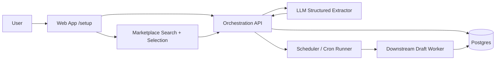

# Architecture - Onboarding, Setup Dashboard, and Marketplace

Last updated: 2026-05-23

This document defines the architecture for the setup flow that replaces the current workflow page. It extends the existing DB-backed instruction profile approach with onboarding, marketplace selection, and schedule orchestration.

Related docs: [ARCHITECTURE.md](./ARCHITECTURE.md), [planned-routes.md](./planned-routes.md), [feature-onboarding-setup-marketplace.md](./feature-onboarding-setup-marketplace.md).

---

## 1) Architecture goals

- Make setup feel like a guided onboarding flow, not a raw settings form.
- Store all important configuration per user in Postgres.
- Use the LLM to convert freeform onboarding answers into a structured profile.
- Support marketplace-style reuse for post styles and hooks.
- Convert the selected weekly schedule into backend cron and worker triggers.
- Feed one stable structured payload into downstream draft generation.

---

## 2) System overview



The web app owns the setup UX. The API owns persistence, validation, marketplace search, and scheduler updates. The worker reads the stored setup bundle when generating drafts.

---

## 3) State model

The setup experience should move through a small number of explicit states.

```text
Incomplete -> CollectingAnswers -> GeneratingProfile -> ReadyForReview -> Completed
```

Suggested state meanings:

- `Incomplete`: no usable profile exists yet.
- `CollectingAnswers`: user is filling the onboarding wizard.
- `GeneratingProfile`: answers were submitted and the LLM is producing structured output.
- `ReadyForReview`: structured output exists, but the user has not confirmed it yet.
- `Completed`: dashboard mode; schedule and marketplace state are available.

If structured generation fails, the system should keep the raw onboarding answers and allow retry.

---

## 4) Data model

### 4.1 Core tables

| Table | Purpose |
|-------|---------|
| `user_setup_profiles` | Structured per-user setup bundle |
| `user_setup_answers` | Raw onboarding answers for re-generation and audit |
| `marketplace_post_styles` | Reusable post style templates |
| `marketplace_hooks` | Reusable hooks templates |
| `user_selected_post_styles` | User-to-style selections and ordering |
| `user_selected_hooks` | User-to-hook selections and ordering |
| `weekly_post_schedules` | Weekly schedule, derived cron, enabled flag |
| `schedule_runs` | Execution history and next-run metadata |
| `setup_audit_events` | Append-only trace for profile generation and schedule changes |

### 4.2 Structured profile shape

The generated setup profile should be stored as structured JSON or normalized columns with at least these fields:

- `industry`
- `icps` (3 or more)
- `writingStyle`
- `brandVoice`
- `personalizationNotes`
- `postConstraints`
- `exampleAngles`

The profile should be versioned or at least timestamped so future generation can trace what the user approved.

### 4.3 Marketplace entities

Marketplace items need ownership and visibility metadata:

- `ownerUserId`
- `visibility` (`private` or `public`)
- `title`
- `description`
- `tags`
- `promptTemplate` or `hookDefinition`
- `createdAt`, `updatedAt`

Public items are searchable by all users. Private items are only searchable by their owner.

---

## 5) API surface

The exact route names can evolve, but the API should expose these capabilities.

| Capability | Suggested route shape | Notes |
|------------|------------------------|-------|
| Load setup state | `GET /v1/me/setup` | Returns completion state and current structured profile |
| Save onboarding answers | `PUT /v1/me/setup/answers` | Stores raw answers before generation |
| Generate structured profile | `POST /v1/me/setup/generate` | Runs LLM extraction and validation |
| Confirm setup | `POST /v1/me/setup/complete` | Marks setup as complete |
| Load dashboard bundle | `GET /v1/me/dashboard` | Returns profile, schedule, selections, and next run |
| Update weekly schedule | `PUT /v1/me/schedule` | Stores weekly grid and derived cron |
| Search post styles | `GET /v1/marketplace/post-styles` | Supports search and visibility filtering |
| Create post style | `POST /v1/marketplace/post-styles` | Allows private or public publishing |
| Search hooks | `GET /v1/marketplace/hooks` | Supports search and visibility filtering |
| Create hook | `POST /v1/marketplace/hooks` | Allows private or public publishing |
| Save selected styles/hooks | `PUT /v1/me/selections` | Persists ordered selections for downstream use |

The existing workflow-context routes can remain as aliases during migration if needed.

---

## 6) LLM extraction pipeline

The onboarding answers should be sent to the LLM as a structured extraction task, not a general chat prompt.

Recommended flow:

1. Web collects the raw answers.
2. API stores the raw answers in `user_setup_answers`.
3. API sends the answers to the LLM with a strict schema.
4. LLM returns structured JSON only.
5. API validates the JSON with Zod or a similar schema.
6. API stores the normalized profile and marks setup ready.

Important implementation note: the worker should consume the stored structured profile, not re-run the onboarding extraction.

---

## 7) Schedule architecture

The schedule UI should feel like a weekly planner, but the backend should still own the authoritative cron job configuration.

Recommended model:

- User chooses days, windows, and preferred posting cadence in the UI.
- API stores the human-friendly schedule plus the derived cron expression.
- Scheduler reads the stored cron data and creates or updates backend jobs.
- On each run, the job runner loads the user profile, selected styles, selected hooks, and generation rules.

This keeps the UI editable while preserving deterministic backend execution.

---

## 8) Marketplace architecture

The marketplace should behave like a reusable content library.

### Post styles

Post styles represent reusable structural templates, such as:

- story-driven post
- technical insight post
- lesson learned post
- opinionated point of view post
- carousel-linked post

### Hooks

Hooks represent reusable opening patterns, such as:

- contrarian opener
- curiosity hook
- proof-first hook
- metric-led hook

### Selection model

Users should be able to:

- Search items by title, tags, or description
- Drag items into their selected stack
- Reorder selected items
- Mix public and private items

The selected stack should be persisted separately from the marketplace catalog so public items remain reusable without mutating the catalog itself.

---

## 9) Downstream generation contract

The worker should receive one stable bundle per user containing:

- Structured profile
- Selected post styles
- Selected hooks
- Weekly schedule
- Any personalization notes or constraints

This bundle becomes the input to downstream agents that generate drafts.

The draft pipeline should not depend on UI state, form step order, or raw frontend field names.

---

## 10) Failure handling

- If profile generation fails, keep the raw answers and allow retry.
- If a marketplace item is deleted, keep user selections as inactive references until the user updates them.
- If cron derivation fails, block schedule activation and surface a validation error.
- If the worker cannot load the setup bundle, emit an audit event and fail the run safely.

---

## 11) Open questions

1. Should setup profile updates create versions, or only overwrite the latest state?
2. Should users be able to publish marketplace items immediately, or require review for public visibility?
3. Should hooks and styles live in one shared marketplace table or remain separate catalogs?
4. Should schedule selection allow multiple posting windows per day in the first release?
5. Should the dashboard include analytics for generated drafts from the selected configuration?
