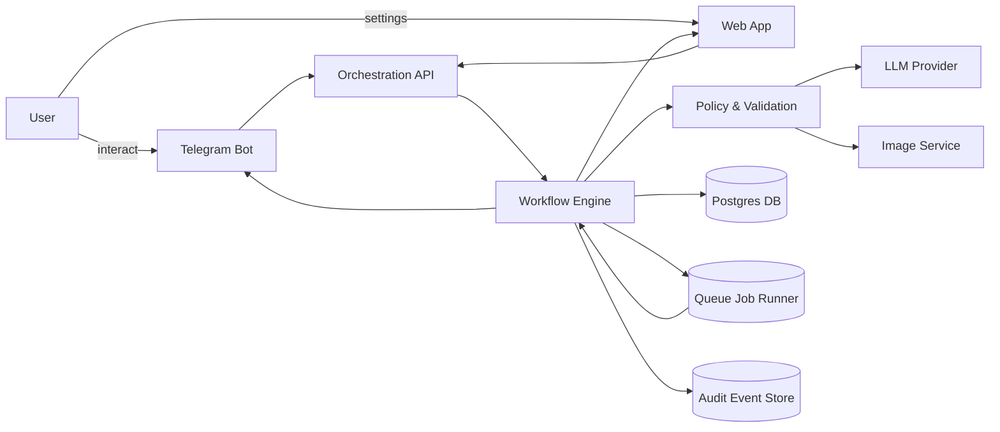
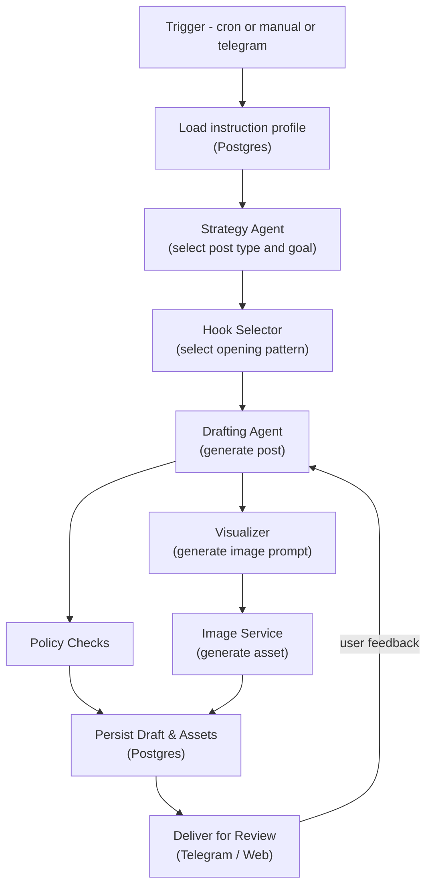
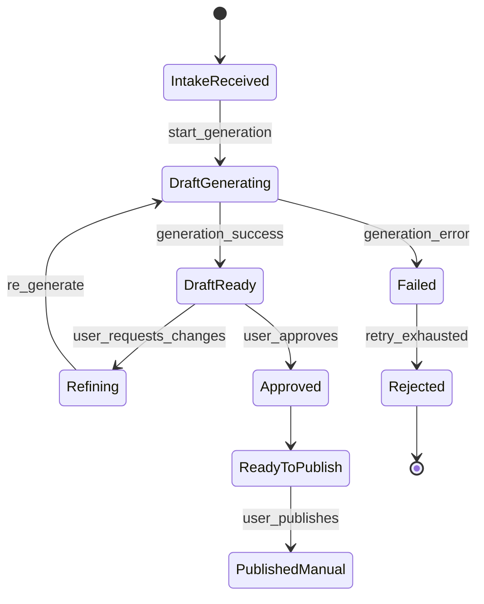
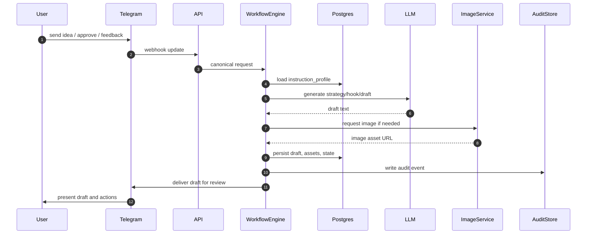

# LinkedIn Agent (MVP Bootstrap)

Monorepo initialized from architecture plan with:

- `web`: Next.js + Tailwind
- `api`: Express + Zod + Prisma
- `worker`: BullMQ-ready worker process
- `packages/shared`: shared types/constants
- `docker-compose.yml`: Postgres + Redis + app services

## Quick start

1. Install dependencies:
   - `pnpm install`
2. Build shared types (also runs automatically before `pnpm dev` via `predev`):
   - `pnpm --filter @linkedin-agent/shared build`
3. Copy env examples as needed:
   - `cp .env.example .env` (or create manually on Windows)
4. Run locally:
   - `pnpm dev`

## Validation scripts

- Lint all packages: `pnpm lint`
- Typecheck all packages: `pnpm typecheck`
- Run smoke tests: `pnpm test`

## Docker

Images use **Node.js 22** (`node:24-alpine`) with multi-stage Dockerfiles (`development` vs final **`production`**).

- **Production-style stack** (optimized runtime images): `pnpm docker:up` (same as `pnpm docker:prod`)
- **Dev stack + live sync** ([Compose Watch](https://docs.docker.com/compose/how-tos/development/)): `pnpm docker:dev`  
  Requires Docker Compose **v2.22+**. Syncs `./api`, `./web`, `./worker`, and `./packages/shared` into containers for hot reload.  
  Also starts **ngrok** for Clerk webhooks — set `NGROK_AUTHTOKEN` in repo-root `.env` (see `.env.example`). Webhook URL: `https://<NGROK_DOMAIN>/v1/webhooks/clerk`.
- Stop and remove volumes (default compose project): `pnpm docker:down`

Override the API URL baked into the **production** Next.js image by setting `NEXT_PUBLIC_API_URL` in your environment before `docker compose up --build` (defaults to `http://localhost:4000` in `docker-compose.yml`).

## Environment notes

- Root `.env.example` defines Docker compose defaults and local `DATABASE_URL` / `REDIS_URL`.
- `api/.env.example` and `worker/.env.example` use local Postgres/Redis defaults.
- `web/.env.example` only requires `NEXT_PUBLIC_API_URL`.

## Notes

- API health endpoint: `http://localhost:4000/health`
- Web app: `http://localhost:3000`
- CI workflow runs lint + typecheck + test on pushes/PRs: `.github/workflows/ci.yml`

## Telegram bot (MVP channel)

Product docs: [Documentation/feature-telegram-bot.md](Documentation/feature-telegram-bot.md).

1. Set `TELEGRAM_BOT_TOKEN` (and optionally `TELEGRAM_WEBHOOK_SECRET`) in `api/.env`.
2. Run API + expose port 4000 over HTTPS (e.g. `pnpm ngrok:webhook`).
3. Register webhook: `WEBHOOK_BASE_URL=https://your-host pnpm --filter @linkedin-agent/api telegram:set-webhook`

## Diagrams

Below are four key diagrams that illustrate the system architecture, generation pipeline, feedback state machine, and data flow sequence used by this project. Use a Markdown renderer that supports Mermaid to view the visuals.

### 1) High-Level Architecture

### 2) Generation Pipeline

### 3) Feedback & Refinement State Machine

### 4) Data Flow Sequence

